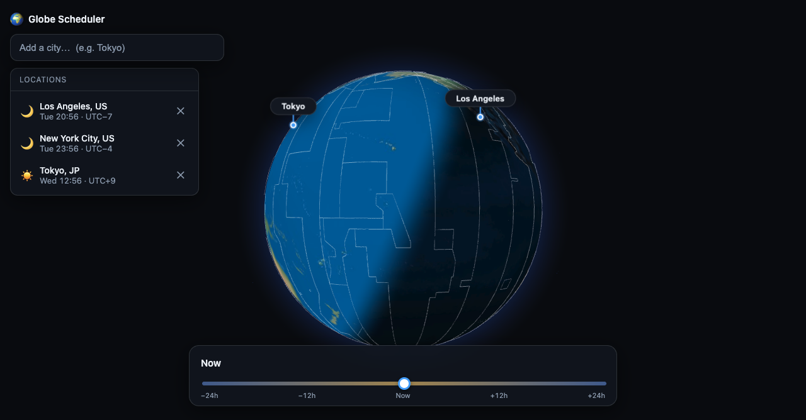

# Globe Scheduler

Find a good time to call family and friends across time zones — at a glance.

A Google-Earth-style 3D globe shows the real **day/night terminator** for right now.
Add each person's city and a pin appears with their **local time** and a ☀️/🌙 badge.
Drag the **time slider** to sweep the reference time forward/backward until everyone
is on the daylit side — that's your call window. No AM/PM math required.



## Run locally

```bash
npm install
npm run dev
```

Then open the printed `localhost` URL (Vite opens it automatically). Everything runs
offline — no API keys, no accounts.

## How to use

1. Type a city in the search bar (e.g. `Tokyo`) and pick it from the dropdown.
2. Add as many locations as you like — each gets a pin and a clock.
3. Drag the slider (±24h). The terminator and every clock update together.
4. Click **Now** to jump back to the current time.
5. Use the **Globe / Map** toggle (top-right) to switch between the 3D globe and a
   flat world map with a sinusoidal terminator — same pins, clocks, and slider.

## How it works

- **Globe & day/night** — [`globe.gl`](https://globe.gl) (three.js). A custom shader
  blends a daytime and nighttime earth texture by the real sun direction, so the
  terminator is astronomically accurate for today's date.
- **Flat map** — an alternate equirectangular (plate carrée) view drawn to a 2D
  canvas, reusing the same textures. The terminator is the great circle 90° from the
  subsolar point, which traces a sinusoid in this projection. Both views subscribe to
  the same store, so they stay in sync.
- **Sun position** — [`solar-calculator`](https://www.npmjs.com/package/solar-calculator)
  gives the subsolar point; [`suncalc`](https://github.com/mourner/suncalc) decides
  day/night at each pin.
- **Clocks** — one absolute instant, formatted per city with the native
  `Intl.DateTimeFormat` (handles DST). This single source of truth keeps every clock
  and the terminator mutually consistent.
- **Cities** — an offline top-10k-by-population dataset with IANA time zones.
- **Time-zone lines** — simplified real boundary GeoJSON drawn as thin surface lines.

## Project layout

```
index.html            UI shell (search, slider, panel, globe mount)
src/
  main.js             wires state -> globe / pins / slider
  state.js            pub/sub store (offset + pins)
  time.js             Intl-based clock formatting
  solar.js            subsolar point + per-pin daylight
  globe.js            globe.gl setup, day/night shader, tz overlay
  cities.js / search.js   offline city search + autocomplete
  pins.js             globe markers + left-panel rows
  slider.js           time slider
  data/cities.json    generated city dataset
public/               earth textures + timezones.geojson
scripts/              data:cities and data:tz generators
```

## Regenerating data (optional)

```bash
npm run data:cities   # rebuild src/data/cities.json from `all-the-cities`
npm run data:tz       # re-download public/timezones.geojson
```

## Not yet built

Deployment, saved/shareable sessions, and calendar export are intentionally out of
scope for this local-first version.
